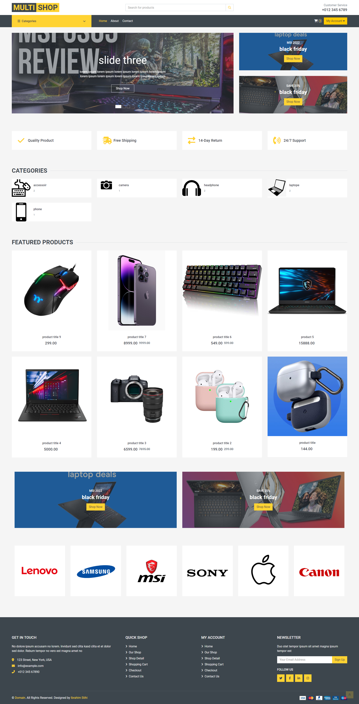
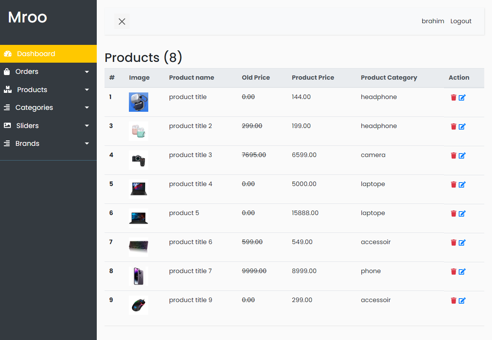

# Laravel Ecommerce Example

  

## Installation

1. Clone the repo and `cd` into it
1. `composer install`
1. Rename or copy `.env.example` file to `.env`
1. `php artisan key:generate`
1. Set your database credentials in your `.env` file and import `maroo.sql` or run `php artisan migrate`
1. run `php artisan db:seed` 
1. Set your Paypal_sandbox or Paypal_live credentials in your `.env` file.
1. Set your `APP_URL` in your `.env` file. This is needed for Voyager to correctly resolve asset URLs.
1. `npm install`
1. `npm run dev`
1. `php artisan serve`
1. Visit `localhost:8000` in your browser

## Admin Dashboard

  

1. Visit `/admin/login`  to access to the admin dashboard . Admin User: `admin@admin.com`.  Password: `admin2022`
1. if you want to change the admin credentials go to `database/factories/AdminFactory.php` and again run `php artisan db:seed`